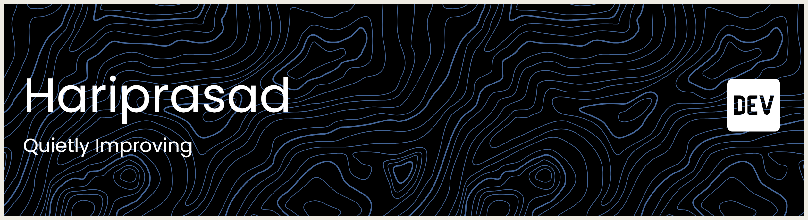

# Hi 👋, I'm Hariprasad AP  
### **Quietly Improving**

  

### 🌱 **About Me**

- 🔭 Currently working on **meaningful projects, not noise**  
- 🌱 Currently learning **RAG, LLMs & the engineering around them**  
- 👯 Looking to collaborate on **AI projects that sharpen real skills**  
- 🤝 Seeking **mentorship that strengthens my engineering craft**  
- 📫 Reach me at **hariprasad5241@gmail.com**

### 🌐 **Connect with Me**

  
  
  
  
  

### 🛠️ **Languages & Tools**

  
  
  
  
  
  
  
  
  
  
  
  
  
  

### ✨ **Quietly building. Slowly improving. Always learning.**

