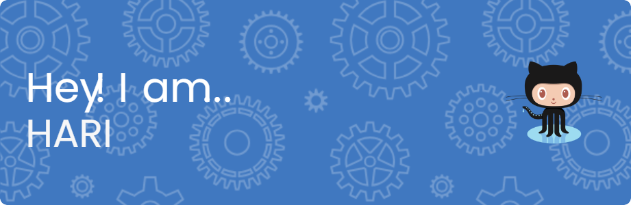

# Hi 👋, I'm Hariprasad AP

### Quietly Improving

  

  

- 🔭 I'm currently working on **meaningful projects, not noise**

- 🌱 I'm currently learning **RAG, LLMs, and the engineering around them**

- 👯 I'm looking to collaborate on **AI projects that sharpen real skills**

- 🤝 I'm looking for help with **Mentorship that sharpens my engineering craft**

- 📫 How to reach me **hariprasad5241@gmail.com**

<h3 align="left">Connect with me:</h3>

<h3 align="left">Languages and Tools:</h3>

              

